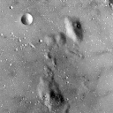
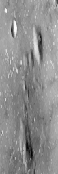

# Convolution Functions

This repository contains code that implements convolution functions used in Neural Networks from scratch without use of external libraries/packages other than [Numpy](https://numpy.org/).
 
This was done as an exercise to get an intuition of the underlying implementation used in Convolutional Neural Network, specifically performing convolution and pooling. So please take in account that this code was written in a few days without any professional review/standard.

## Getting Started

All the code can be found in ["convolution.py"](convolution.py). This file contains function to perform:
- greyscale convolution
- rgb convolution
- max pooling
- average pooling  

There is also a ["examples.py"](examples.py) to run some examples of the convolution functions on the two images ([4.1.07.tiff](4.1.07.tiff), [5,1,09.tiff](5,1,09.tiff)).

### Prerequisites

- [matplotlib](https://matplotlib.org/)
- [Numpy](https://numpy.org/)

### Running the examples

Every example is separated into functions that can be called in a separate script by importing "examples.py"

You can run all the examples in one go this way:

```[python]
python3 examples.py
```

## Results

### Greyscale convolution  


### Rgb convolution  


### Max pooling shrink




### Max pooling blur


### Max pooling stretch




### Average pooling shrink


### Average pooling blur


### Average pooling stretch


## Authors

- **Raphael Van Hoffelen** - [github](https://github.com/dskart) - [website](https://www.raphaelvanhoffelen.com/)

## License

This project is licensed under the MIT License - see the [LICENSE.md](LICENSE.md) file for details
